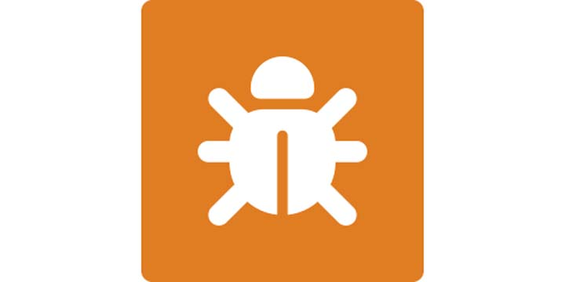
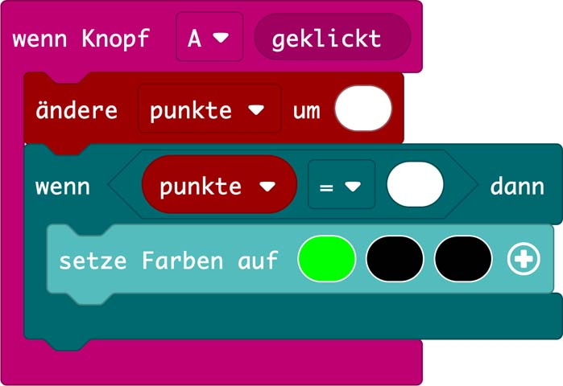

# 4.1 Spiele: Schere, Stein, Papier

## Aufgabe @showdialog
Zwei Personen spielen Schere, Stein, Papier gegeneinander. Pro gewonnen Runde gibt es einen Punkt. Wer zuerst 3 Punkte hat, hat gewonnen. 

**Spielablauf:**
- 2 Personen spielen jeweils mit einem Calliope mini.
- Beide Calliope mini werden gleichzeitig geschüttelt.
- Per Zufall wird auf beiden Calliope mini eines von drei Zeichen angezeigt - Schere, Stein oder Papier.
Die Punkte werden manuell über den Knopf A vergeben. 


## Aufgabe 3a:

Erstelle eine ``||variables.Variable||`` mit dem Namen "``zeichen``" 

```blocks
let zeichen = 0
```

## Aufgabe 3b:

Programmiere anhand deines Struktogramms.

Tipp: Füge eine ``||basic.Pause||``  hinzu, um ein erneutes
Schütteln pro Runde zu verhindern.

```blocks
let zeichen = 0
input.onGesture(Gesture.Shake, function () {
    zeichen = randint(1, 3)
    if (zeichen == ) {
        basic.showIcon(IconNames.Scissors)
    }
    basic.pause(2000)
})

```

## Aufgabe 3c:

Überprüfe im Debugging Modus, ob alle Zahlen
vorkommen.



## Punktevergabe: @showdialog

Die Person, die die Runde gewonnen hat, drückt den Knopf A und die Punkte werden um einen Punkt erhöht.
Pro Punkt leuchtet eine RGB-LED grün.
Sind drei Punkte erreicht, ertönt ein akustisches Signal.

## Aufgabe 4-5

Schau dir den Programmcode in der Glühbirne an und ergänze die fehlenden Angaben. 

Tipp: Vergiss nicht, die Variable
punkte zu definieren.




## Geschafft! 👍

Klicke auf ``|Herunterladen|``, um dein Programm auf deinen Calliope mini zu übertragen.


```blocks
let Punkte = 0
let zeichen = 0
input.onButtonEvent(Button.A, input.buttonEventClick(), function () {
    Punkte += 1
    if (Punkte == 1) {
        basic.setLedColors(0x00ff00, 0x000000, 0x000000)
    } else if (Punkte == 2) {
        basic.setLedColors(0x00ff00, 0x00ff00, 0x000000)
    } else if (Punkte == 3) {
        music.playTone(440, music.beat(BeatFraction.Whole))
        basic.setLedColors(0x00ff00, 0x00ff00, 0x00ff00)
    } else {
        basic.turnRgbLedOff()
    }
})
input.onGesture(Gesture.Shake, function () {
    zeichen = randint(1, 3)
    if (zeichen == 1) {
        basic.showIcon(IconNames.Scissors)
    }
    if (zeichen == 2) {
        basic.showIcon(IconNames.SmallSquare)
    }
    if (zeichen == 3) {
        basic.showIcon(IconNames.Square)
    }
    basic.pause(2000)
})
```


```template
//
```

```package
v3
```