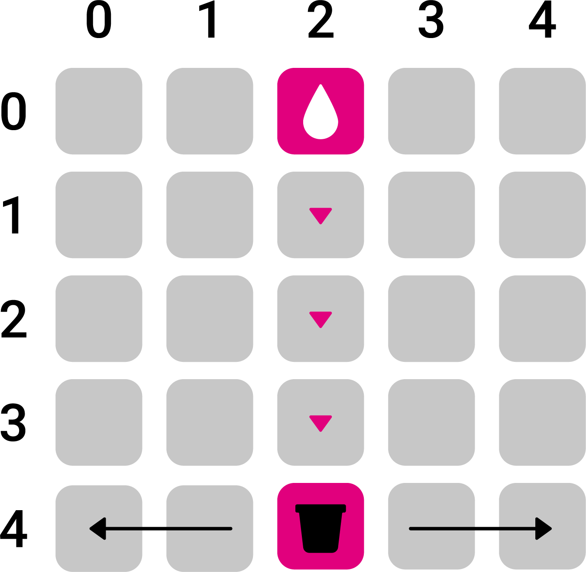
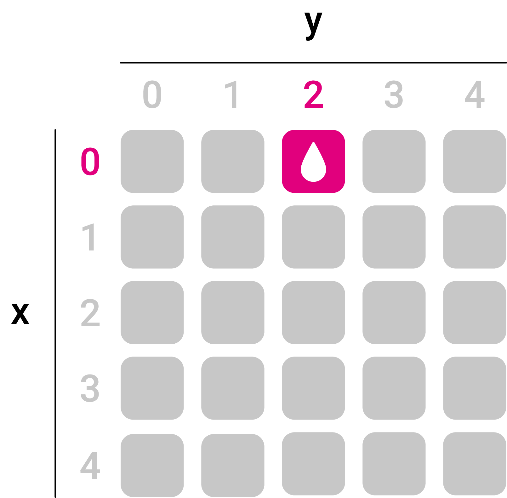

# 4.3 Regentropfen fangen

## Aufgabe @showdialog
Lerne die Codeblöcke in der Kategorie Spiel unter Fortgeschritten kennen

## Spielablauf  @showdialog
- Regentropfen fallen von oben nach unten. 
- Mit einem Eimer werden die Regentropfen gefangen.
- Wird ein Regentropfen gefangen, gibt es einen Punkt.
- Wird der Regentropfen verfehlt, wird ein Leben abgezogen.
- Sind alle Leben aufgebraucht, ist das Spiel zu Ende und die Punkte werden angezeigt.




## Aufgabe 1a: Regentropfen Steuerung

Erzeuge ein Sprite, positioniere es mittig ganz oben in der ersten Reihe der LED-Matrix und weise es einer Variablen mit dem Namen wasser zu.



## Aufgabe 1b: @unplugged

Vervollständige den Code und teste im Simulator

```blocks
let wasser = game.createSprite(2, 0)
wasser.change(LedSpriteProperty.Y, 1)
```

## Aufgabe 1c:

Vervollständige den Code wie in Abb. x und teste im Simulator.
Abb. Code s. Slide
Beschreibe was passiert. [Damit sich der Regentropen auf der y-Achse bewegt, wird eine 90° Drehung nacht rechts benötigt. 
Hier ist das Ausprobieren wichtig!]
Abb. Linien
Drehe das Sprite so, dass es sich durch die Bewegung nach unten bewegt.
Vervollständige das Struktogramm anhand des Pseudocodes:
Prüfe dauerhaft: Wenn die aktuelle y-Position kleiner als 4 ist, dann wird der Regentropfen 1 Position nach unten bewegt.
Ansonsten wird die y-Position wieder auf 0 gesetzt und eine zufällige Position auf der x-Achse definiert.
Programmiere anhand des Struktogramms.
Füge eine Pause hinzu, um das Tempo einzustellen.
Abb. Struktogramm

## Eimer Steuerung
Erstelle einen Sprite mit dem Namen Eimer und positioniere ihn mittig ganz unten in der untersten Reihe der LED-Matrix.
Abb. Matrix Position
- Programmiere den Knopf A so, dass der Eimer sich nach links bewegt.
- Programmiere den Knopf B so, dass der Eimer sich nach rechts bewegt.


Wichtige Blöcke:
Abb. s. Slide

## Starteinstellungen

Vervollständige den Spielstart:
Setze den Spielstand auf 0. 
Setze die Anzahl Leben auf 5.

## Kollisionsabfrage+Auswertung

Erweitere dein Programm um folgende Logik:
Wenn sich die Sprites Eimer und Wasser berühren, wird der Spielstand um einen Punkt erhöht und die RGB-LEDs leuchten grün, ansonsten werden die Leben um einen Punkt reduziert und die RGB-LEDs leuchten rot.


Extra
Finde eine eigene Logik. Lasse die Anzahl der Leben über die 3 RGB-LEDs anzeigen. 
Kleiner Tipp: Mit der Farbe Schwarz schaltest du einzelne RGB-LEDs aus.

Was würde das Spiel einfacher oder schwieriger machen?
An einer Stelle im Programmcode kann das Spiel über eine Zahl in der Schwierigkeit verändert werden. Weißt du, an welcher Stelle?

## Ergebnis

test

```blocks
input.onButtonEvent(Button.A, input.buttonEventClick(), function () {
    eimer.move(-1)
})
input.onButtonEvent(Button.B, input.buttonEventClick(), function () {
    eimer.move(1)
})
let eimer: game.LedSprite = null
let wasser = game.createSprite(2, 0)
eimer = game.createSprite(2, 4)
game.setLife(5)
game.setScore(0)
basic.forever(function () {
    if (wasser.get(LedSpriteProperty.Y) < 4) {
        wasser.change(LedSpriteProperty.Y, 1)
    } else {
        if (wasser.isTouching(eimer)) {
            basic.setLedColor(0x00ff00)
            game.addScore(1)
        } else {
            basic.setLedColor(0xff0080)
            game.removeLife(1)
        }
        wasser.set(LedSpriteProperty.X, randint(0, 4))
        wasser.set(LedSpriteProperty.Y, 0)
    }
    basic.pause(500)
})

```


## Geschafft! 👍
Klicke auf ``|Herunterladen|``, um dein Programm auf deinen Calliope mini zu übertragen.


```ghost

```


```template

```

```package
v3
```