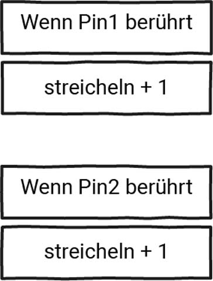

# 5.1.2 Digitales Haustier: Streicheln

## Aufgabe @showdialog
Dein Haustier liebt es, gestreichelt zu werden. 
- Berühre den Pin P1, um es zu streicheln.
- Wird dein Haustier gestreichelt, blinkt ein Herz auf der LED-Matrix. 
- Je mehr es gestreichelt wird, desto schneller ist die Blinkfrequenz.
- Wurde es genug gestreichelt, erscheint das Herz permanent auf der LED-Matrix.
- Berührst du es an Pin P2, wird es ärgerlich und die Blinkfrequenz verlangsamt sich.


## Aufgabe 2a:

Erstelle eine ``||variables.Variable||`` mit dem Namen ``streicheln``.

```blocks
let streicheln = 0
```

## Aufgabe 2b/c:

Verändere den Wert der Variable streicheln anhand des Struktogramms. Überprüfe im Debugger.



```blocks
input.onPinTouchEvent(TouchPin.P1, input.buttonEventDown(), function () {
    streicheln += 1
})
input.onPinTouchEvent(TouchPin.P2, input.buttonEventDown(), function () {
    streicheln += -1
})
```

## Aufgabe 2d-e:

Erstelle eine dauerhaft blinkende Herz-Animation. 
Füge ``||basic.Pausen||`` hinzu.

```blocks
basic.forever(function () {
    basic.showIcon(IconNames.Heart)
    basic.pause(500)
    basic.clearScreen()
    basic.pause(500)
})

```

## Aufgabe 2f:

Erstelle eine weitere ``||variables.Variable||`` mit dem Namen
``tempo`` und ersetze die Angaben der Pausen durch
die Variable tempo.

```blocks
let Tempo = 1000
let streicheln = 0
basic.forever(function () {
    basic.showIcon(IconNames.Heart)
    basic.pause(Tempo)
    basic.clearScreen()
    basic.pause(Tempo)
})

```

## Aufgabe 2g:

Das Tempo verändert sich. Schaue in die Tabelle und stelle eine Gleichung auf:

| streicheln | tempo |
| -------- | ------- |
| 0 | 1000 |
| 1 | 800  |
| 2 | 600  |
| 3 | 400  |
| 4 | 200  |
| 5 | 0    |

```blocks
let Tempo = 1000 - 200 * streicheln
```

## Aufgabe 2h:
Entferne das Blinken, sobald das Tempo kleiner oder gleich 0 ist.

```blocks
input.onPinTouchEvent(TouchPin.P1, input.buttonEventDown(), function () {
    streicheln += 1
})
input.onPinTouchEvent(TouchPin.P2, input.buttonEventDown(), function () {
    streicheln += -1
})
let Tempo = 1000
let streicheln = 0
basic.forever(function () {
    Tempo = 1000 - 200 * streicheln
    if (Tempo >= 200) {
        basic.showIcon(IconNames.Heart)
        basic.pause(Tempo)
        basic.clearScreen()
        basic.pause(Tempo)
    } else {
        basic.showIcon(IconNames.Heart)
    }
})

```

## Geschafft! 👍
Klicke auf ``|Herunterladen|``, um dein Programm auf deinen Calliope mini zu übertragen.


```ghost
basic.showLeds(`
. . . . .
. . . . .
. . # . .
. . . . .
. . . . .
`)
```

```package
v3
```