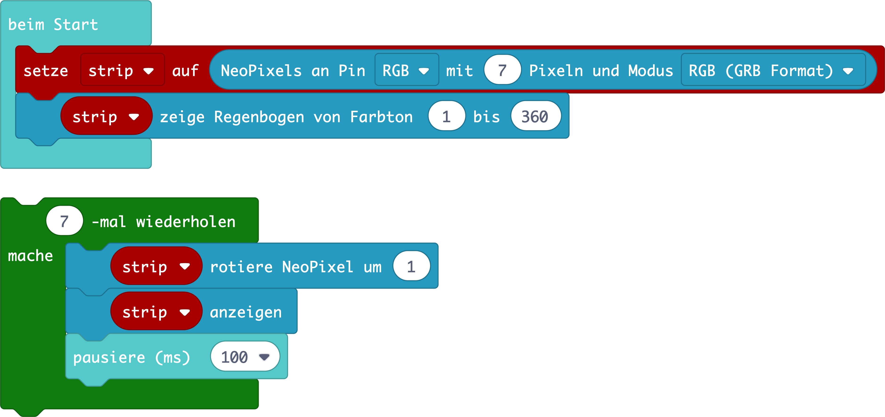

# 5.1.5 Digitales Haustier: Schlafen

## Aufgabe 5: Schlafen @showdialog
Steuere die Anzeige der Müdigkeit deines Haustiers über die Helligkeit der LED-Matrix.
Lege dein Haustier für eine Zeit in einem abgedunkelten Raum und lasse es ausruhen.
Nach einer kurzen Weile ist es wieder hellwach.
Lasse einen Regenbogen erscheinen, wenn es ausgeschlafen ist


## Aufgabe 4a

Schalte alle LEDs der ``||basic.LED-Matrix||`` an.

```blocks
basic.showLeds(`
    # # # # #
    # # # # #
    # # # # #
    # # # # #
    # # # # #
    `)
```

## Aufgabe 4b

Erstelle eine ``||variables.Variable||`` mit dem Namen ``muedigkeit`` und setze sie auf 0. Die Variable soll später Werte zwischen 0 (ganz müde) und 255 (hellwach) annehmen.

```blocks
let muedigkeit = 0
```

## Aufgabe 4c

Erstelle eine ``||logic.Abfrage||``, die dauerhaft prüft, ob dein Haustier sich an einem dunklen
Ort befindet.

```blocks
basic.forever(function () {
    if (input.lightLevel() < 100) {

        }
    })
```

## Aufgabe 4d-f

Wenn es dunkel (Lichtstärke unter 100), ändere die ``||variables.Variable||``  ``muedigkeit`` um 25 und ``||basic.warte||`` für eine Sekunde. 
Überprüfe im Debugger.


```blocks
let muedigkeit = 0
basic.forever(function () {
    if (input.lightLevel() < 100) {
            muedigkeit += 25
            basic.pause(1000)
        }
    })
```

## Aufgabe 4f

Ansonsten ändere die ``||variables.Variable||`` ``muedigkeit`` um -25 und ``||basic.warte||`` für eine Sekunde.

```blocks
let muedigkeit = 0
basic.forever(function () {
    if (input.lightLevel() < 100) {
            muedigkeit += 25
            basic.pause(1000)
        } else {
            muedigkeit += -25
            basic.pause(1000)
        }
    })
```

## Aufgabe 4g

Erweitere deine ``||logic.Abfrage||``, so dass die ``||variables.Variable||`` ``muedigkeit`` im Bereich von 0-255 bleibt.

```blocks
let muedigkeit = 0
basic.forever(function () {
    if (input.lightLevel() < 100) {
        if (muedigkeit < 250) {
            muedigkeit += 25
            basic.pause(1000)
        }
    } else {
        if (muedigkeit > 0) {
            muedigkeit += -25
            basic.pause(1000)
        }
    }
})
```

## Aufgabe 4h

Verwende den Wert der ``muedigkeit`` für die Helligkeit der ``||led.LEDs||`` der LED-Matrix.

```blocks
let muedigkeit = 0
    led.setBrightness(muedigkeit)
```

## Aufgabe 4i

Lasse die ``||basic.RGB-LED||`` grün leuchten, wenn dein Haustier ausgeschlafen ist
(muedigkeit > 200).

```blocks
let muedigkeit = 0
basic.forever(function () {
    if (muedigkeit > 200) {
        basic.setLedColor(0x00ff00)
        basic.pause(1000)
        basic.turnRgbLedOff()
    }
})
```
<!-- ## Extra-Aufgabe 1

Du kannst einzelne Programmbauteile auch in Funktionen zusammenfassen. Erstelle eine Funktion ``hellwach()`` und lass dort drin die LED grün aufblinken. -->

## Extra-Aufgabe

Du kannst anstelle der grünen RGB-LED auch einen Regenbogen Effekt
programmieren. Benutze dafür die Neopixel Erweiterung.




## Ergebnis

Füge alle Programmteile zusammen und klicke auf ``|Herunterladen|``, um dein Programm auf deinen Calliope mini zu übertragen und zu testen.

```blocks

let muedigkeit = 0
basic.forever(function () {
    if (input.lightLevel() < 100) {
        if (muedigkeit < 250) {
            muedigkeit += 25
            basic.pause(1000)
        }
    } else {
        if (muedigkeit > 0) {
            muedigkeit += -25
            basic.pause(1000)
        }
    }
    led.setBrightness(muedigkeit)
    basic.showLeds(`
        # # # # #
        # # # # #
        # # # # #
        # # # # #
        # # # # #
        `)
    if (muedigkeit > 200) {
        basic.setLedColor(0x00ff00)
        basic.pause(1000)
        basic.turnRgbLedOff()
    }
})

```

```ghost
basic.setLedColors(0xff0000, 0xff0000, 0xff0000)
```

```package
v3
neopixel=github:microsoft/pxt-neopixel
```